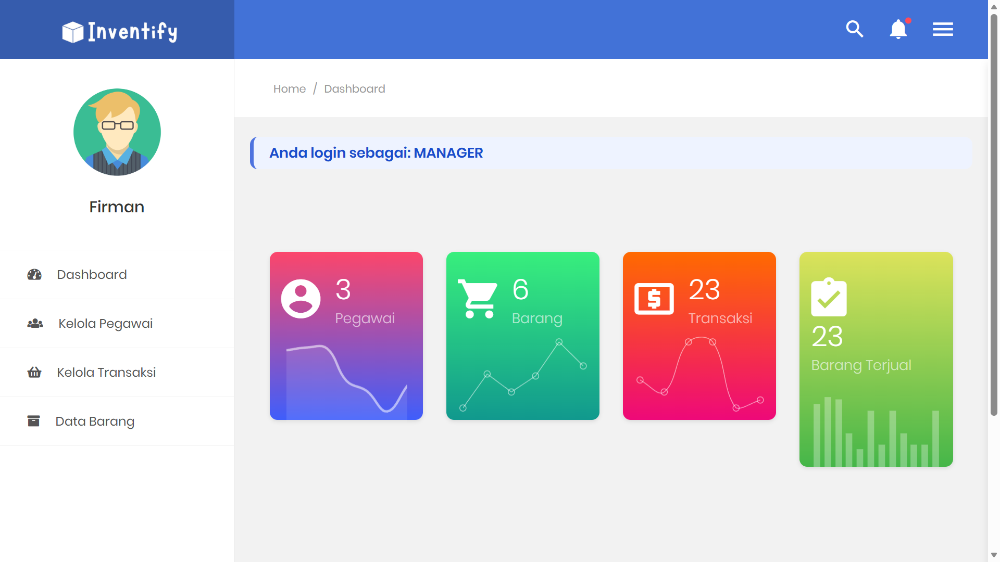
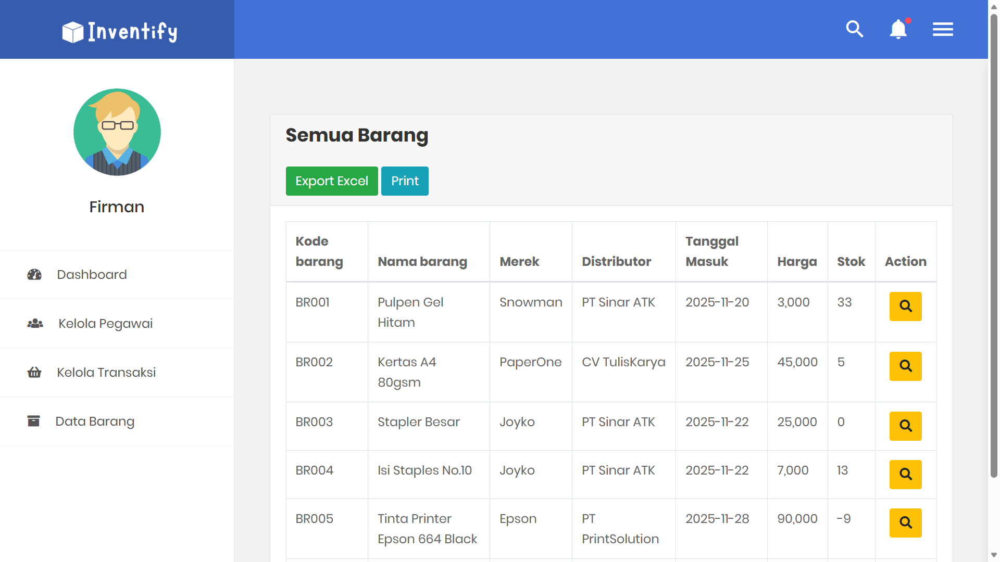
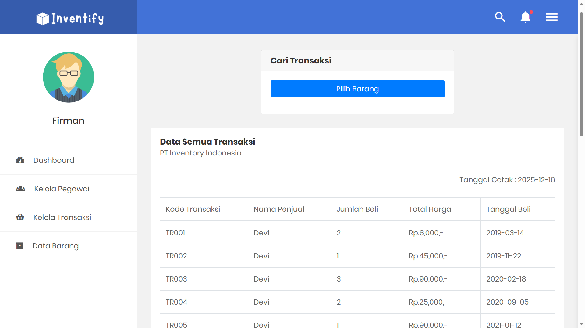

# 📦 Sistem Inventaris Barang Kantor

**Nama**   : Erna Dewi Lestari  
**NIM**    : 221011403284  
**Kelas**  : 07TPLP020  
**Prodi**  : Teknik Informatika  
**Fakultas** : Ilmu Komputer  
**Universitas** : Universitas Pamulang  
**Mata Kuliah** : Pemrograman Web II

Aplikasi web berbasis **PHP & MySQL** untuk mengelola inventaris barang kantor.  
Sistem ini mendukung pengelolaan data barang serta transaksi penjualan dengan pembagian role **Admin, Manager, dan Kasir**.

---

## 👤 Role Pengguna
- **Admin**: Mengelola barang, merek, distributor, dan notifikasi transaksi  
- **Manager**: Melihat laporan barang dan transaksi  
- **Kasir**: Melakukan transaksi, pembayaran, dan cetak struk  

---

## 🧩 Fitur Utama
- Login multi role
- CRUD Data Barang, Merek, dan Distributor
- Transaksi kasir
- Pembayaran & kembalian otomatis
- Cetak struk transaksi
- Laporan transaksi & stok barang

---

## 🛠️ Teknologi
- PHP Native  
- MySQL (MariaDB)  
- Bootstrap  
- jQuery  
- SweetAlert  
- DataTables  

---

## 🧾 Tampilan & Penjelasan Halaman

### 🔐 Halaman Login

Halaman login digunakan sebagai pintu masuk ke dalam sistem.  
Pengguna harus memasukkan username dan password yang valid untuk dapat mengakses sistem sesuai dengan role masing-masing.

---

### 🧑‍💼 Dashboard Admin

Dashboard admin menampilkan ringkasan data sistem seperti jumlah barang, merek, dan distributor.  
Admin juga dapat melihat notifikasi transaksi yang dilakukan oleh kasir.

---

### 📦 Data Barang (Admin)

Halaman data barang digunakan oleh admin untuk mengelola seluruh data barang.  
Admin dapat menambah, mengubah, menghapus, serta melihat detail barang seperti stok, harga, merek, distributor, dan foto barang.

---

### 🧑‍🏫 Dashboard Manager

Dashboard manager berfungsi untuk memantau kondisi inventaris dan transaksi secara keseluruhan.  
Manager hanya memiliki hak akses melihat data tanpa dapat melakukan perubahan.

---

### 📊 Laporan Barang (Manager)

Halaman laporan barang menampilkan data barang berdasarkan periode tertentu.  
Manager dapat memantau kondisi stok barang termasuk barang yang stoknya menipis.

---

### 📈 Laporan Transaksi (Manager)

Halaman laporan transaksi digunakan untuk melihat riwayat transaksi yang terjadi.  
Manager dapat melakukan filter transaksi berdasarkan tanggal untuk analisis penjualan.

---

### 🧾 Dashboard Kasir

Dashboard kasir digunakan sebagai halaman utama kasir sebelum melakukan transaksi.  
Kasir dapat langsung menuju menu transaksi dari halaman ini.

---

### 🛒 Transaksi Kasir

Halaman transaksi digunakan oleh kasir untuk melakukan penjualan barang.  
Kasir memilih barang dan jumlah pembelian, lalu sistem menghitung subtotal secara otomatis.

---

### 💰 Pembayaran

Halaman pembayaran digunakan untuk menyelesaikan transaksi.  
Kasir memasukkan jumlah uang yang dibayarkan dan sistem otomatis menghitung kembalian.

---

### 🧾 Struk Transaksi

Halaman struk menampilkan detail transaksi yang telah selesai.  
Struk dapat dicetak sebagai bukti pembayaran kepada pelanggan.

---

## ⚙️ Cara Menjalankan
1. Clone repository ini  
2. Import database `inventaris_barang_kantor.sql`  
3. Jalankan XAMPP (Apache & MySQL)  
4. Akses melalui browser  
