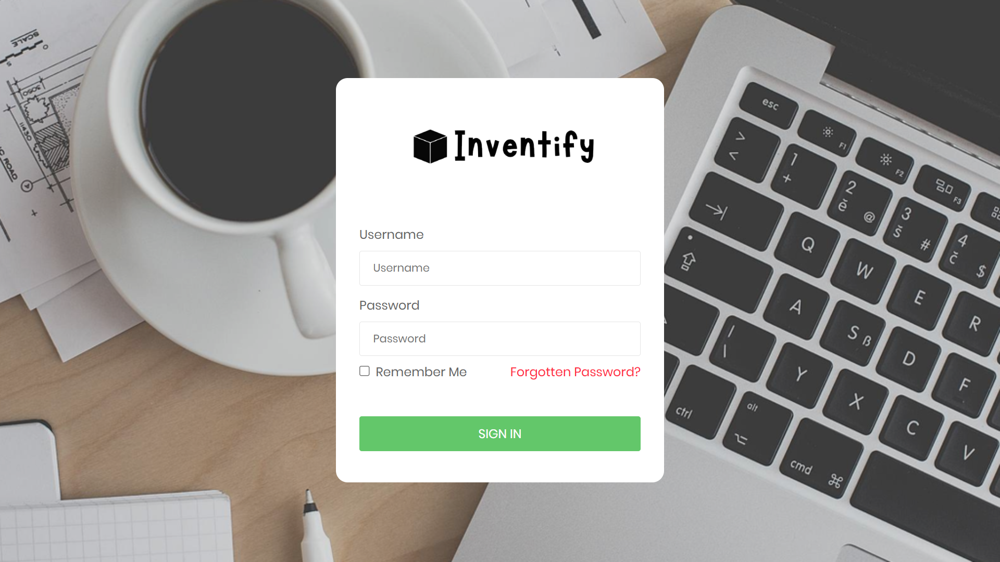
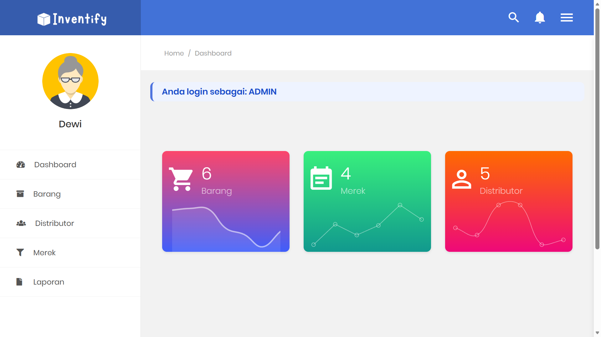
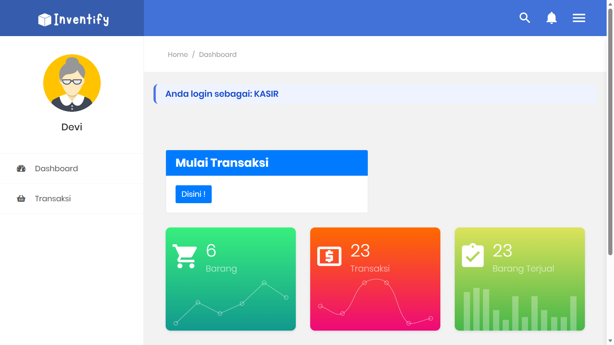
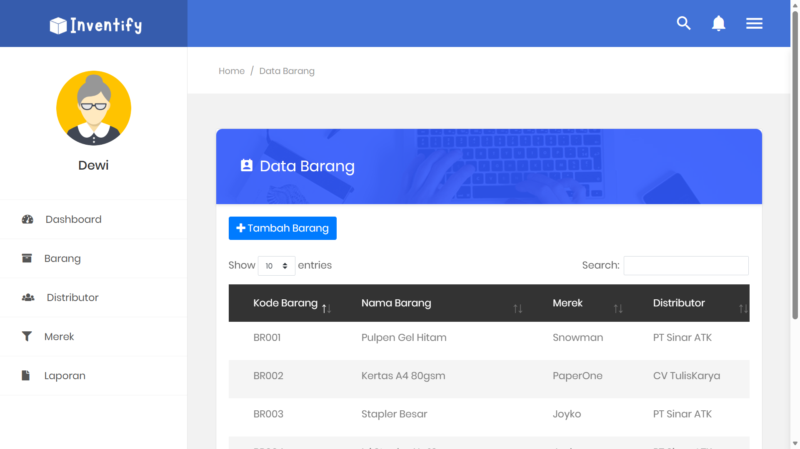
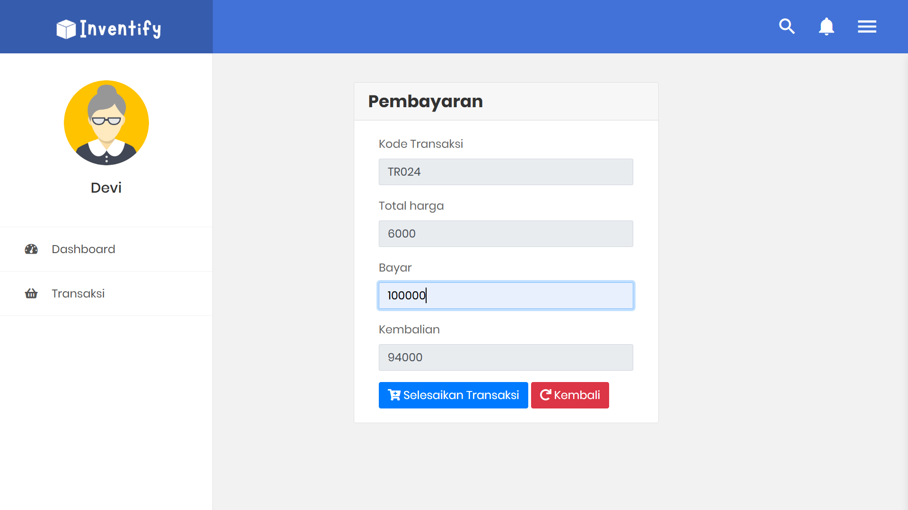
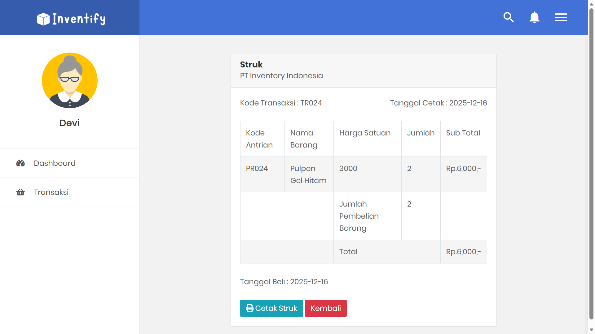

# 📦 Sistem Inventaris Barang Kantor

Aplikasi web berbasis **PHP & MySQL** untuk mengelola inventaris barang kantor.  
Sistem ini mendukung manajemen barang, merek, distributor, serta transaksi penjualan dengan pembagian role **Admin** dan **Kasir**.

---

## 👤 Role Pengguna
- **Admin**
  - Kelola barang
  - Kelola merek
  - Kelola distributor
  - Melihat notifikasi transaksi
- **Kasir**
  - Melakukan transaksi
  - Pembayaran
  - Cetak struk transaksi

---

## 🧩 Fitur Utama
- Login multi role (Admin & Kasir)
- CRUD Data Barang
- CRUD Data Merek
- CRUD Data Distributor
- Transaksi kasir
- Pembayaran & kembalian otomatis
- Cetak struk transaksi
- Notifikasi transaksi ke admin

---

## 🛠️ Teknologi
- PHP Native
- MySQL (MariaDB)
- Bootstrap
- jQuery
- SweetAlert
- DataTables

---

## 🗂️ Struktur Halaman
| Halaman | Role |
|------|------|
| Login | Admin / Kasir |
| Dashboard | Admin / Kasir |
| Data Barang | Admin |
| Data Merek | Admin |
| Data Distributor | Admin |
| Transaksi | Kasir |
| Pembayaran | Kasir |
| Struk Transaksi | Kasir |

---

## 📸 Screenshot Aplikasi

### Login

### Dashboard Admin

### Dashboard Kasir

### Data Barang

### Transaksi Kasir

### Pembayaran

### Struk Transaksi

---

## ⚙️ Cara Menjalankan
1. Clone repository ini
2. Import database `inventaris_barang_kantor.sql`
3. Jalankan XAMPP (Apache & MySQL)
4. Akses melalui browser  
